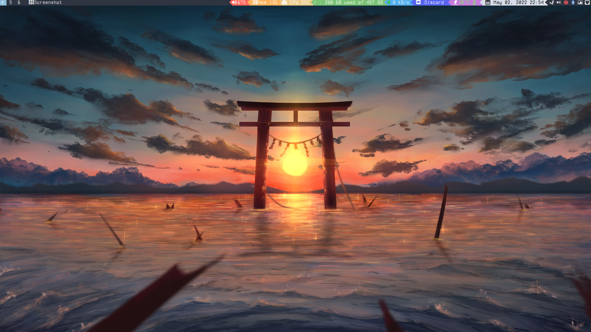

# Dotfiles

## What are Dotfiles?

  

Dotfiles are a way to customize your Linux / UNIX machine! This files are
located in the `/.config/` folder and they all start with a period (.) - hence,
*dotfiles*. This repository contains my personal dotfiles for you to analyze,
edit, or use.

## Info

- **WM** -> `bspwm`
- **Terminal** -> `alacritty`

## Initial Installations

- any type of Nerd Font
- [picom-jonaburg](https://github.com/jonaburg/picom) - for rounded window corners and blurry terminal background. **NEW!**: now comes with animations
- [ueberzug](https://github.com/seebye/ueberzug) - displaying images in ranger terminal app
- zsh shell

## ZSH 

### Packages to Download

`yay -S zsh zsh-syntax-highlighting autojump zsh-autosuggestions`

### Setup

```
touch "$HOME/.cache/zshhistory"
#-- Setup Alias in $HOME/zsh/aliasrc
git clone --depth=1 https://github.com/romkatv/powerlevel10k.git ~/powerlevel10k
echo 'source ~/powerlevel10k/powerlevel10k.zsh-theme' >> ~/.zshrc
```

### Bash to ZSH

`chsh $USER`

then type

`/bin/zsh`
